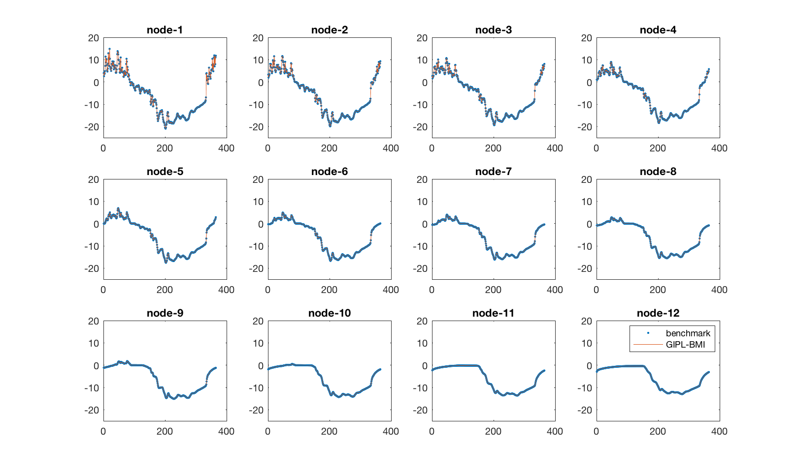
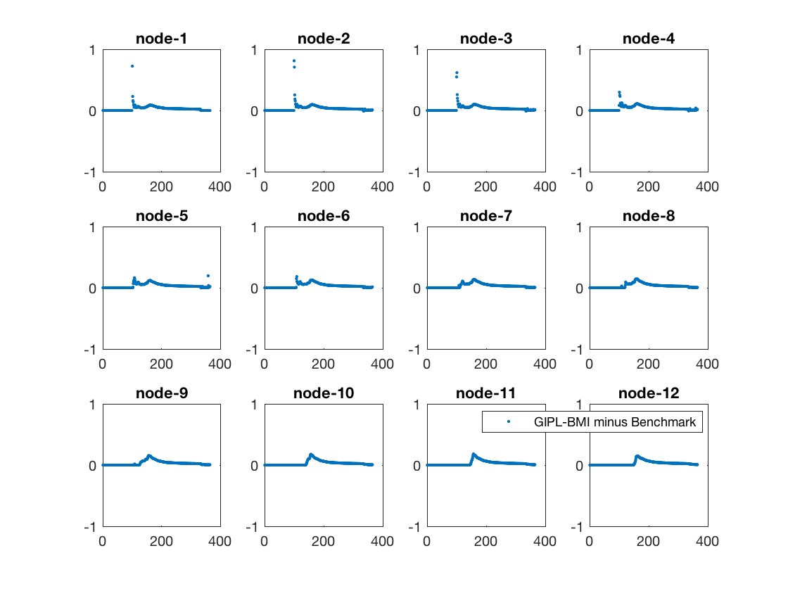
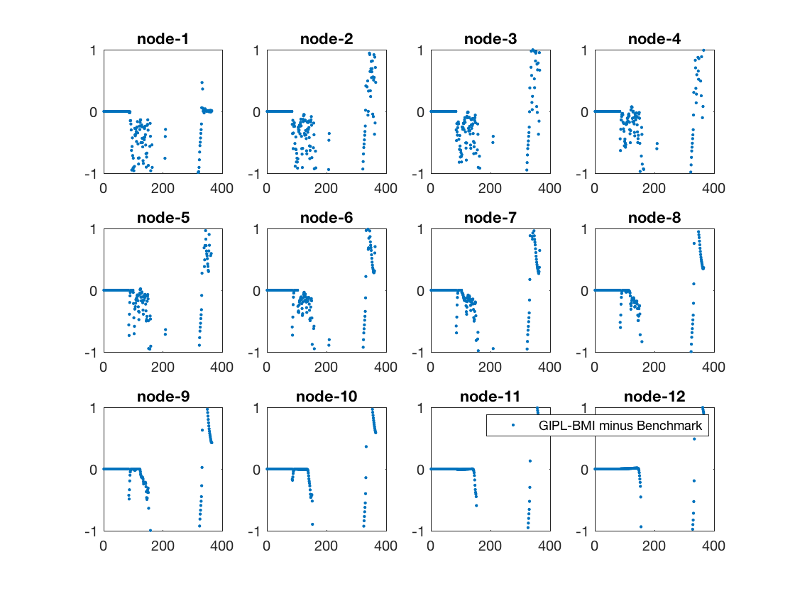
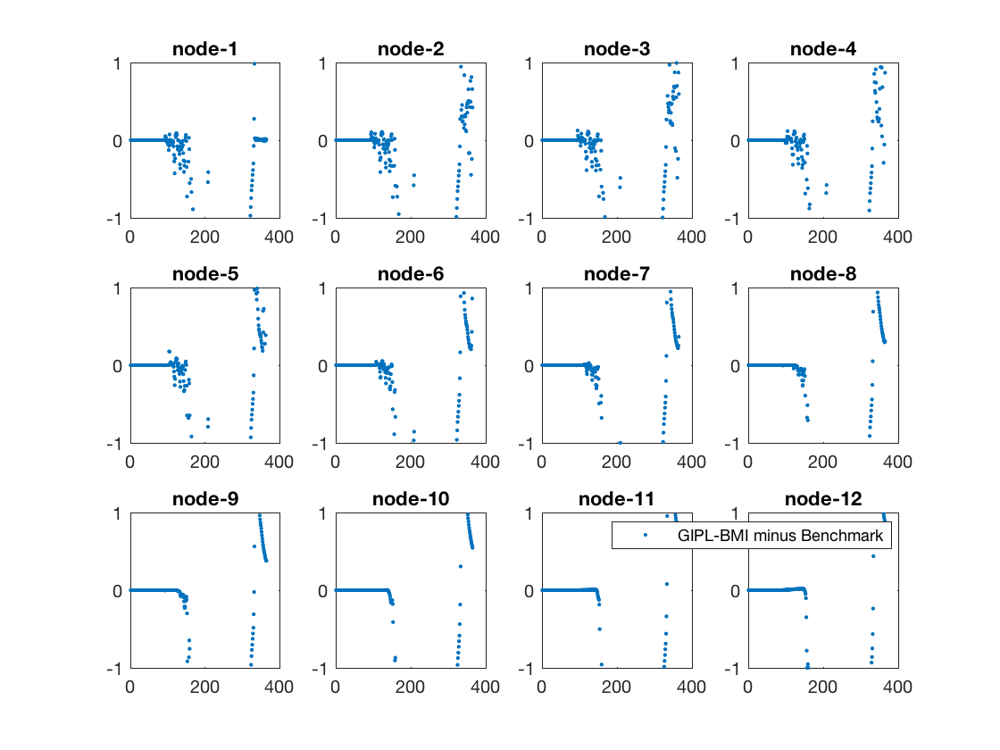

# GIPL_BMI_Fortran

#### This is to develop a BMI for GIPL with FORTRAN. Original GIPL code is avaiable at [this repository](https://github.com/Elchin/GIPL).

[](https://travis-ci.org/permamodel/GIPL-BMI-Fortran)

#### **NOTE: Currently, it is only 1D version. More works are required for the spatial version**

#### The main changes are:

	- make a new function to advance the model step-by-step
	- modify "initialize" & "update" to ensure passing changes in climatic forcing, soil parameters from BMI to the mode.
	- add a new interface on the original model, in order to make as few as changes
	- make the BMIs
	- make tests and examples
	- make cmake files
	- modify "filexist". Removing "stop" in order to get a correct running status
	- add an option to set write out to file or not, default is not.

### 1. Compile with cmake ###

> `mkdir _build && cd _build`  
> `cmake .. -DCMAKE_INSTALL_PREFIX=[install_path]`  
> `make install`  
> `source ../scripts/update_rpaths.sh`  
> `ctest`
> 

### 2. Current input variables [to be added]

| Standard Name                             | Description                                                                                                                       | Unit     | Type    |
|-------------------------------------------|-----------------------------------------------------------------------------------------------------------------------------------|----------|---------|
| land\_surface\_air\_\_temperature             | SURFACE TEMPERATURE FIELDS (TEMPERATURES FROM THE START TO THE END OF THE INTERVAL)                                               | deg.C    | Real    |
| snowpack\_\_depth                   | SNOW DEPTH                | m     | Real |
| snow\_\_thermal\_conductivity                   | SNOW THERMAL CONDUCTIVITY                | W m-1 K-1    | Real |
| soil\_water\_\_volume\_fraction                   | Volumetric Water Content                | m3 m-3    | Real |
| soil\_unfrozen\_water\_\_a                  | Soil Unfrozen Water Parameter 'a'                | -    | Real |
| soil\_unfrozen\_water\_\_b                  | Soil Unfrozen Water Parameter 'b'                | -    | Real |

### 3. Current output variables [to be added]

| Standard Name                             | Description                                                                                                                       | Unit     | Type    |
|-------------------------------------------|-----------------------------------------------------------------------------------------------------------------------------------|----------|---------|
| soil\_\_temperature             | SOIL TEMPERATURE at all Nodes (including snow layers when there are snow covered)                                              | deg.C    | Real    |
| model\_soil\_layer\_\_count             | number of all nodes (including snow layers when there are snow covered)                                              | -    | integer    |

### 4. Comparison between GIPL-BMI outputs and GIPL outputs.



### 5. Known issues

- Known issues are related to grid type, grid_id, grid_size, etc. The follow parameters could be set by using "set\_value\_at\_indices". Because these variables are defined at few layers rather than each soil node. For example, in the example case, "soil\_\_temperature" has 176 nodes while "soil\_water\_\_volume\_fraction" is set at 6 layers. It's possible to define a new grid\_id, grid\_type, etc for this kind of variables.

 - "soil\_water\_\_volume\_fraction" ! VWC
 - "soil\_unfrozen\_water\_\_a" ! UWC\_a
 - "soil\_unfrozen\_water\_\_b" ! UWC\_b

### 5. Examples to use GIPL-BMI

**Please see also the souce code file "GIPL/bmi_main.f90"**

Here we tested 

- baseline simulation (the case to be compared with benchmark)
- change air temperature at 95th day

```fortran
if (i .eq. 95) then ! change air temperature at the 5th time step.

    s = model%set_value('land_surface_air__temperature', [-10.0])

end if
```


- change snow depth at 100th day

```fortran
if (i .eq. 100) then ! change snow depth at the 100th time step.

     s = model%set_value('snowpack__depth', [0.1])

end if
```


- change snow thermal conductivity at 110th day

```fortran
if (i .eq. 110) then ! change snow thermal conductivity at the 110th time step.

     s = model%set_value('snow__thermal_conductivity', [0.01])

end if
```


- change volumetric soil water content since 85th day

```fortran
if (i .eq. 85) then ! change VWC in first soil layer in 'geo.txt' file.

     s = model%set_value_at_indices('soil_water__volume_fraction', [1], [0.1])

end if
```



- change soil unfrozen water parameter *a* since 92nd day

```fortran
if (i .eq. 92) then ! change UWC_a in first soil layer in 'geo.txt' file.

     s = model%set_value_at_indices('soil_unfrozen_water__a', [1], [0.1])

end if
```



- change soil unfrozen water parameter *b* since 92nd day 

```fortran
if (i .eq. 92) then ! change UWC_b in first soil layer in 'geo.txt' file.

    s = model%set_value_at_indices(var_name6, [1], [-0.5])

end if
```

